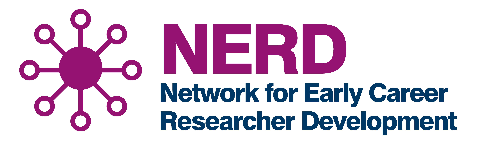

# Hackathon 2026

[Registration is now open! Apply here by 29th May 2026.](TODO){.btn .btn-info .btn role="button" data-toggle="tooltip" title="Sign up form"}

Welcome to the University of Glasgow Computational Biology Hackathon.

Are you passionate about unravelling the mysteries of life through code and data? Do you dream of collaborating with brilliant minds to tackle complex biological problems? Look no further! Our exclusive hackathon is designed for researchers, students, and enthusiasts who share a common goal: advancing computational biology.

[See what we got up to last year!](https://glasgow-compbio.github.io/events/202506_Hackathon/){.btn .btn-info .btn role="button" data-toggle="tooltip" title="Hackthon 2025"}

## Timeline

This year we have decided to change the process of collecting project proposals. We are going to start with an initial expression of interest and an abstract submission. Below is the outlined hackathon timeline.

1.  Step 1: Full project proposal deadline ([email us](mailto:compbio-conference@glasgow.ac.uk): 31st March 2026 (Closed). Following the project submission, the team will review your proposals and liaise further with you to help shape exciting but achievable projects.

2.  Step 2: [Participants application form](TODO) opens 11th May 2026, and closes 29th May 2026 (now open!)

3.  Step 3: Hackathon event, 10th-12th June 2026

Let us know if you have any questions, we can’t wait to see your ideas!

## Event Details

-   **Date**: 10th-12th June, 2026

-   **Time:** 10am-4pm

-   **Location**: McMillan Round Reading Room, University Ave, Glasgow, G12 8QF

## Why Participate?

1.  **Interdisciplinary Exploration**: Dive into the intersection of biology, computer science, and big data analysis.

2.  **Networking**: Connect with fellow researchers and forge collaborative relationships across the University.

3.  **Challenging Problems**: We have curated an exciting range of projects with associated data. Choose your challenge!

4.  **Skill Enhancement**: Learn new coding and data handling skills.

## Who Should Attend?

Whatever your career stage or job title, we would love to hear from you if you have skills you think could benefit a team. Whether you are from a wet-lab, dry-lab, or non-lab background, we would love you to bring your skills to a highly interdisciplinary team. We strongly encourage those in non-research roles and those from non-traditional scientific backgrounds to apply, and we select participants based on skills and enthusiasm, not perceived status!

-   [**Undergrads**:](TODO) Are you interested in problem solving? Do you have programming skills you wish to apply to biological problems? Do you have biological knowledge you can bring to a team? Are you wondering if research is a potential next step? [Sign up!](TODO) 

-   [**Postgrads**:](TODO) Whether you’re a Masters or a PhD candidate, this hackathon is your chance to apply computational techniques to real-world biological questions.

-   [**Researchers**:](TODO) Join forces with fellow scientists to crack complex problems. Collaborate, brainstorm, and innovate!

-   [**Scientific/Technical Staff**:](TODO) Can you bring your expertise or insight to help solve biological problems? Please sign up!

-   [**PIs**:](TODO) Share your expertise and mentor the next generation of computational biologists.

## The Projects

TODO

## FAQs

**Q1:** I want to participate but worried about my coding skills/AI knowledge/etc?

A1: Hackathons are a great environment to learn, so don't worry, just be upfront with your team lead. You can still contribute in so many ways, like ideas, writing, biological knowledge, management, etc.

**Q2:** I can only attend 2 out of the 3 days. Is this a problem?

A2: While attending the full duration of the Hackathon would be beneficial, we understand that committing 3 days might be difficult for some. Please include that information in your application form.

**Q3:** I am an undergrad/master student and worried about my skills suitability.

A3: See Q1. We welcome participants from diverse backgrounds and you can contribute in many different ways. Also, please note that some projects require initial preparation before the Hackathon.

**Q4:** What if I don't know any other participants?

A4: This is a great opportunity to get to know people from across the university! You don't need to have spoken to anyone prior to signing up, you will be made very welcome, and there will be many other people in the same position.

**Q5:** Will I definitely be included in the team for my preferred project?

A5: We aim to offer every participant a spot on their preferred team but this may not be possible if a project is oversubscribed. If there is a project you don't want to be considered for, please indicate this on the form.

## Registration

[Sign up here!](TODO) Registration closes 29th May 2026

## Acknowledgements

We are hugely grateful to our sponsors -- without their support this event would not be possible!

{width="400"}
